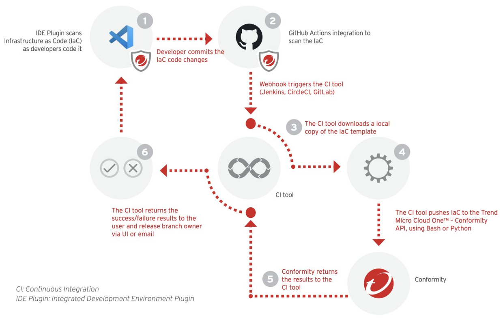

# CLOUDSEC2020 - Workflows with Conformity

### By using CloudFormation Template Scanner you can proactively prevent issues by shifting left. Automate your Infrastructure as Code (IaC) scans, before deployment, improving the efficacy of your AWS CloudFormation templates. 

### Using the Cloud Conformity API or UI, and the full Knowledge Base of checks, configuration errors and mistakes are detected and easily remediated from the very earliest phase of your CI/CD pipeline or directly in VSCode. Your templates can instantly be run through the API, during the coding process, or upon completion, for peace of mind that the code moves forward with full compliance, into your infrastructure.


#### In this example, we're running the scanner against the ```myapp.yaml``` Cloud Formation Template which is updating a S3 buckets that stores a Static Website. To scan this template we're using VSCode with the [Conformity Extension from the marketplace](https://marketplace.visualstudio.com/items?itemName=raphaelbottino.cc-template-scanner), to scan in our CI/CD pipeline, we're using our [GitHub Action](https://github.com/marketplace/actions/cloud-one-conformity-pipeline-scanner) published in the GitHub Marketplace and inside the ```.github/workflow``` we have our pipeline file that describe the actions taken.


```
# Fix Bucket Encryption
      BucketEncryption:
        ServerSideEncryptionConfiguration: 
          -
            ServerSideEncryptionByDefault:
              SSEAlgorithm: AES256
```




